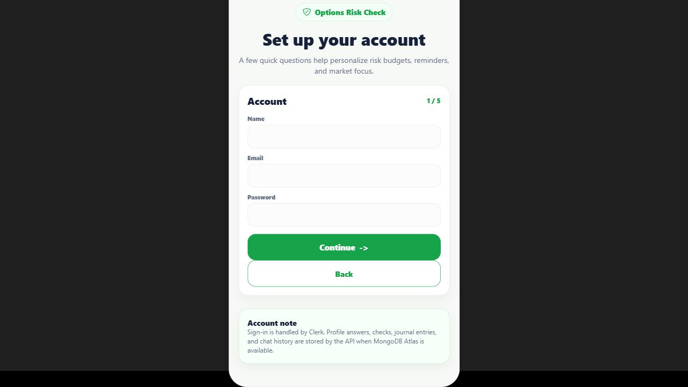
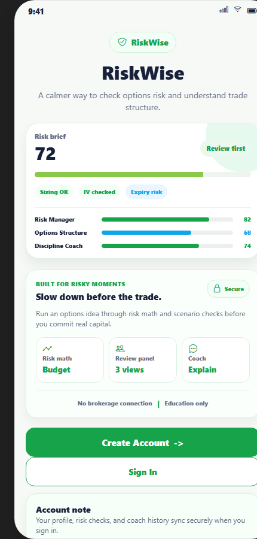
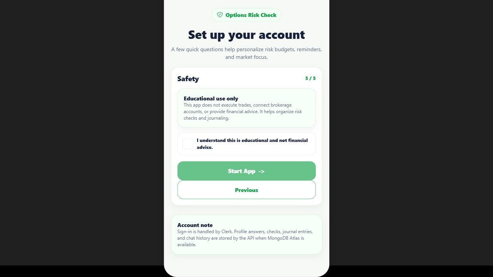
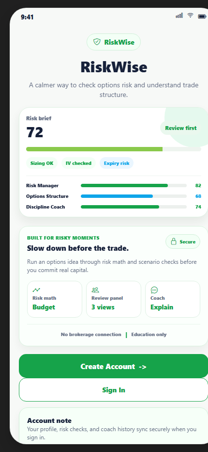

# RiskWise — AI Options Trade Investigation Platform

RiskWise helps options traders slow down before acting by checking contract structure, sizing, missing evidence, and behavioral risk through a multi-agent risk review.

> RiskWise is educational decision-support software. It does not execute trades, provide financial advice, or recommend buying/selling securities.

## What Is RiskWise?

RiskWise is a mobile-first app for reviewing options trades before the user gets emotionally attached to the idea.

The app asks for the contract details, checks the basic risk math, points out missing evidence, and gives the user a structured investigation report. The goal is not to predict the market. The goal is to help a trader understand what can go wrong before putting money at risk.

## Why I Built It

This project started after I tested a few stock and options research systems. The most useful lesson was not that a model could magically predict prices. It was that options can create fast upside, but the same structure can also lose money quickly when position sizing, expiration, volatility, or liquidity are ignored.

That pushed RiskWise toward a narrower product: a pre-trade review tool for options decisions.

## What Problem It Solves

Options trades often fail for reasons that are knowable before the trade:

- the premium risk is too large for the account
- the contract expires too soon
- breakeven requires a larger move than the user realizes
- bid/ask or liquidity information is missing
- the trade depends on earnings volatility without checking IV risk
- the setup is based on a story instead of evidence

RiskWise tries to make those failure modes visible.

## Current Features

- Three check paths: Stock Idea, Option Contract, and Screenshot
- Step-by-step option contract builder
- Contract risk math: max loss, account risk, breakeven, days to expiration, and sizing checks
- Investigation summary with issue cards
- Multi-agent debate view with different risk perspectives
- RiskWiseAI Coach with trade context
- Profile memory for risk rules, explanation style, and common mistakes
- FastAPI backend with MongoDB-ready storage
- Expo React Native mobile prototype
- CI for backend tests and mobile demo checks

## Screenshots

### Check Flow



### Investigation Results



### Profile



### Coach



## How The Check Flow Works

RiskWise starts by asking how the user wants to check a trade:

1. **Stock Idea**: the user has a ticker and an outlook, but not a contract yet.
2. **Option Contract**: the user already knows the contract details.
3. **Screenshot**: the user wants to upload a contract screenshot from a trading platform.

The contract flow asks for:

- ticker
- direction
- option type
- expiration
- strike and premium
- contracts and account size

Then the app builds an investigation report instead of a simple pass/fail answer.

## Multi-Agent Review System

RiskWise uses separate review roles so the result does not collapse into one fake certainty score.

- **Bull Analyst** looks for the strongest case supporting the thesis.
- **Skeptic** looks for the clearest failure mode.
- **Options Risk Agent** focuses on premium, IV, expiration, and liquidity.
- **Sizing Judge** checks account risk and position size.
- **Risk Manager** looks at drawdown, rules, and whether the setup fits the user's profile.

The agents are designed to disagree when the evidence is mixed.

## Profile And Personalization

The profile stores settings that should change how the app reviews trades:

- experience level
- risk style
- preferred explanation style
- favorite markets
- common mistakes to watch
- max risk per trade
- max trades per week
- warning rules for short expirations and large premium risk

The same contract can be reasonable for one user and too aggressive for another. RiskWise should reflect that.

## Tech Stack

**Frontend**

- Expo
- React Native
- React Native Web
- JavaScript

**Backend**

- FastAPI
- Python
- MongoDB Atlas-ready storage
- Pydantic models
- pytest

**AI and Data**

- LLM provider adapter for Gemini/OpenAI/fallback routing
- FMP-ready market data adapter
- Planned options-chain provider integration

## Architecture

```text
User Input
  -> Trade Builder
  -> Risk Math Engine
  -> Issue Detection
  -> Multi-Agent Review
  -> Investigation Report
  -> Coach
```

See [docs/ARCHITECTURE.md](docs/ARCHITECTURE.md) for the longer version.

## What Works Now

- Check flow prototype
- Profile personalization prototype
- Coach with trade context
- Local scoring engine
- Saved checks
- Backend test suite
- GitHub Actions CI

## What Is Experimental

- Screenshot extraction
- Multi-agent reasoning
- Market data integration
- App Store release path
- Live options-chain scoring
- Real IV, Greeks, bid/ask, volume, and open interest analysis

## Safety Disclaimer

RiskWise is educational decision-support software. It does not execute trades, provide financial advice, or recommend buying/selling securities.

The app should not be used as proof that a trade is safe or profitable. Options can lose money quickly, including the full premium paid. Any market data or AI-generated explanation should be checked against a real broker or data provider before a user makes a decision.

## Local Setup

### Frontend

```bash
cd frontend/mobile-demo
npm install
npm run web
```

### Backend

```bash
cd backend
python -m venv .venv
.venv\Scripts\activate
pip install -r api/requirements.txt
python -m uvicorn api.app:app --reload --host 127.0.0.1 --port 8000
```

On macOS/Linux, use:

```bash
source .venv/bin/activate
```

### Environment

Copy `.env.example` to your local environment file and fill in local keys. Real secrets should stay in `config/.env`, `frontend/mobile-demo/.env`, or deployment environment variables. Do not commit them.

## Roadmap

- **v0.1**: local MVP
- **v0.2**: better check flow
- **v0.3**: profile personalization
- **v0.4**: screenshot extraction
- **v0.5**: real option chain integration
- **v0.6**: TestFlight beta
- **v1.0**: public launch

See [docs/ROADMAP.md](docs/ROADMAP.md).

## Project Status

**Project Status: Active MVP**

Current:

- Check flow prototype
- Profile personalization prototype
- Coach with trade context
- Local scoring engine
- Saved checks

Experimental:

- Screenshot extraction
- Multi-agent reasoning
- Market data integration
- App Store release

## Suggested GitHub Topics

`options`, `trading-tools`, `react-native`, `expo`, `fastapi`, `ai-agents`, `fintech`, `risk-management`, `student-project`, `decision-support`
