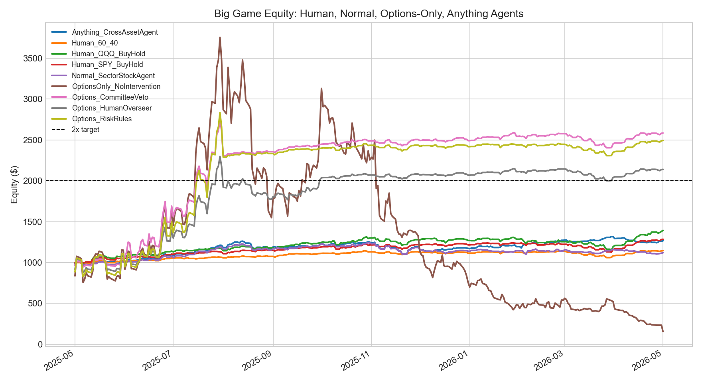
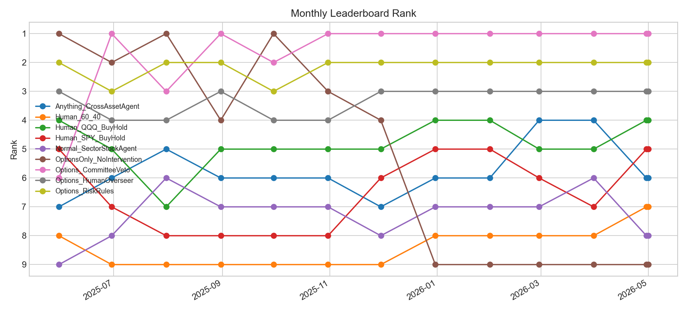

# AI Trading Arena Research Lab

This repo is a research sandbox for testing trading agents on historical market data.

The main question is simple:

> Can an options-focused agent find big upside, and can risk intervention keep it from blowing up?

The short answer from the current experiment:

- Raw options trading found huge upside, then collapsed.
- Options plus risk rules kept the upside.
- The best risk-aware options agent turned `$1,000` into about `$2,585`.
- The same raw options agent peaked near `$3,756`, but ended around `$155`.

This is not trading advice. It is a test harness.

## Main Result

Big game period:

- Start: `2025-05-01`
- End: `2026-05-01`
- Starting capital: `$1,000`
- Target: `$2,000`
- Rebalance: monthly
- Data source: Yahoo Finance through `yfinance`

| Rank | Agent | Ending Value | Return | Max Value | Hit 2x? | Max Drawdown |
|---:|---|---:|---:|---:|---|---:|
| 1 | `Options_CommitteeVeto` | `$2,585.20` | `+158.52%` | `$2,754.14` | Yes | `-16.15%` |
| 2 | `Options_RiskRules` | `$2,493.88` | `+149.39%` | `$2,835.82` | Yes | `-23.13%` |
| 3 | `Options_HumanOverseer` | `$2,140.31` | `+114.03%` | `$2,297.54` | Yes | `-23.02%` |
| 4 | `Human_QQQ_BuyHold` | `$1,393.57` | `+39.36%` | `$1,393.57` | No | `-12.20%` |
| 5 | `Human_SPY_BuyHold` | `$1,285.03` | `+28.50%` | `$1,285.03` | No | `-9.14%` |
| 9 | `OptionsOnly_NoIntervention` | `$155.01` | `-84.50%` | `$3,755.75` | No at end | `-95.87%` |

The main insight:

> The edge was not just options. The edge was options plus forced capital preservation.

## Charts





## How To Run It

Create an environment:

```bash
python -m venv .venv
.venv\Scripts\activate
pip install -r requirements.txt
```

Run the main big game:

```bash
python -m ai_trading_arena big-game --start 2025-05-01 --end 2026-05-01 --history-start 2023-01-01 --capital 1000 --target 2000
```

Run the stricter sector-only walk-forward:

```bash
python -m ai_trading_arena sector-period --start 2024-05-01 --end 2026-05-01 --history-start 2023-01-01 --capital 1000
```

Run tests:

```bash
python -m pytest
```

Run the local validation helper:

```bash
python scripts/validate_research.py
```

## What The Agents Are

`OptionsOnly_NoIntervention`

Buys monthly at-the-money call option proxies on the strongest momentum names. It keeps swinging even after winning. It is the cautionary tale.

`Options_RiskRules`

Uses mechanical rules. If it reaches 2x, it locks gains into SPY/TLT/cash. If it draws down too much, it stops taking option risk.

`Options_HumanOverseer`

Simulates a human risk manager. The human can approve, reduce, or reject new options exposure at month end. The rules are fixed before the test.

`Options_CommitteeVeto`

The options agent proposes trades. A stock model and cross-asset model warn about risk. A veto layer can shrink option exposure or lock gains.

`Human_SPY_BuyHold`, `Human_QQQ_BuyHold`, `Human_60_40`

Simple human-style benchmarks.

`Normal_SectorStockAgent`

Stock-only sector momentum agent.

`Anything_CrossAssetAgent`

Can choose across stocks, ETFs, bonds, gold, dollar, FX proxies, and bitcoin.

## Important Caveat

The options model is a proxy. It uses Black-Scholes monthly at-the-money calls because free Yahoo data does not provide clean point-in-time historical option chains.

That means this is useful for research direction, not proof that the exact trades were available at those exact prices.

If someone wants to audit this seriously, the next step is to replace the option proxy with a paid historical option chain dataset.

## Files To Review

- `ai_trading_arena/big_game.py`: main options and human-in-the-loop experiment
- `ai_trading_arena/big_game_agents/benchmarks.py`: SPY, QQQ, and 60/40 human-style benchmarks
- `ai_trading_arena/big_game_agents/options_agents.py`: no-intervention, risk-rules, human-overseer, and committee-veto options agents
- `ai_trading_arena/big_game_agents/stock_agents.py`: stock-only and cross-asset agents
- `ai_trading_arena/big_game_agents/accounting.py`: portfolio accounting, option proxy pricing, fills, and marking
- `ai_trading_arena/big_game_agents/signals.py`: shared momentum score
- `ai_trading_arena/period_backtest.py`: sector walk-forward experiments
- `ai_trading_arena/agents.py`: daily paper-trading agents
- `ai_trading_arena/context.py`: sector, news, liquidity, earnings, and options context helpers
- `tests/test_ai_trading_arena.py`: leakage, constraints, accounting, and sector tests
- `reports/big_game_research_report.md`: readable research summary
- `reports/sector_focus_research_audit.md`: audit notes for the sector test

## What To Ask Reviewers

Ask people to check:

- Is the options proxy reasonable?
- Are the rules written before the test, or are they overfit to this period?
- Are there any lookahead leaks?
- Is the benchmark comparison fair?
- Are transaction costs too low or too high?
- Would this survive on real option-chain data?

## Not Financial Advice

This project is for research and coding practice. It should not be used to trade real money without much more validation.
